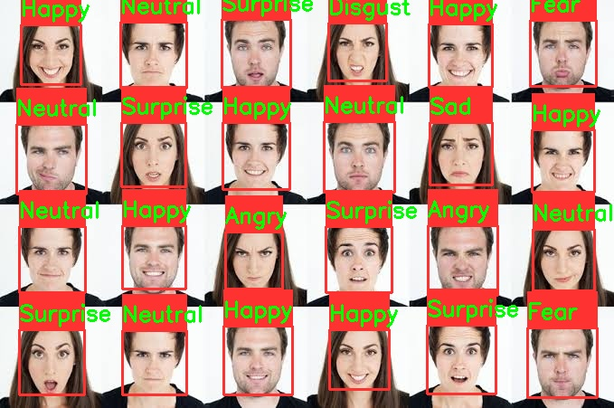
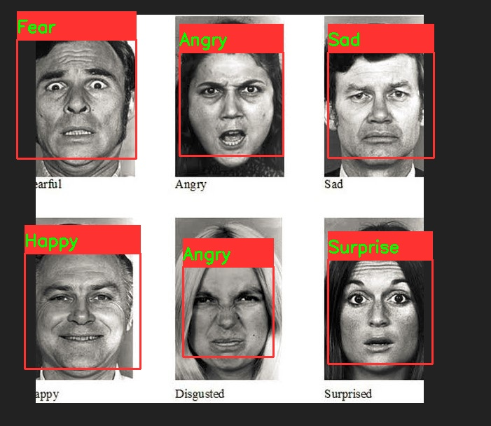

# Facial Emotion Detection

A deep learning model that classifies facial emotions into seven categories: `angry`, `disgust`, `fear`, `happy`, `neutral`, `sad`, and `surprise`.

## Description

This project aims to detect and classify emotions from facial expressions using a trained deep learning model. The model has been trained on the FER-2013 dataset and achieves an accuracy of 90% after 30 epochs.

## Features

- Classifies facial emotions into seven categories.
- Trained on the FER-2013 dataset.
- Achieves 90% accuracy after 30 epochs.

## Technologies Used

- Python
- TensorFlow/Keras
- OpenCV
- NumPy
- Pandas

## Installation

Follow these steps to install and run the project:

1. **Clone the repository:**
   ```bash
   git clone https://github.com/Zzabi/Facial-emotion-Detection.git
   cd Facial-emotion-Detection
   ```
2. **Create and activate virtual environment:**
   ```bash
   conda create -n fer python=3.9.* anaconda
   conda activate fer
   ```
3. **Install the required dependencies:**
   ```bash
   pip install requirements.txt
   ```
4. Download the FER-2013 dataset:
   Download the dataset from [here](https://www.kaggle.com/datasets/msambare/fer2013) and place it in the data/ directory.

5. Train the model (change the no of epochs as required)
   ```bash
   python main.py
   ```

## Usage

1. **Run the prediction script:**
   ```bash
   python predict.py --path path/to/your/image.jpg # image
   python predict.py --path path/to/your/video.mp4 # video
   python predict.py --path 1 #realtime
   ```
## Screenshots

Here are some examples of the model in action:






